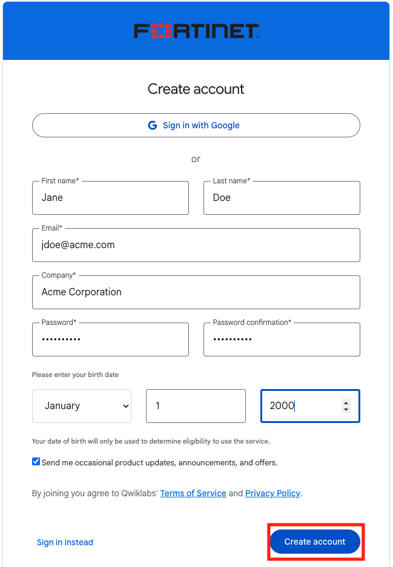
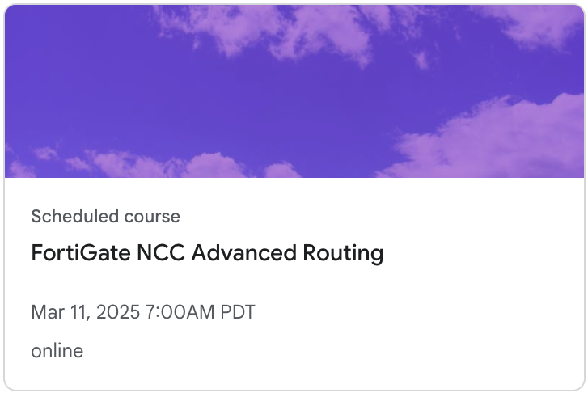

## Navigate to Fortinet Qwiklabs

This lab will use [Qwiklabs](https://fortinet.qwiklabs.com) to build all of the required infrastructure.

If you already have an account, click this [link](https://fortinet.qwiklabs.com/users/sign_in) to sign in using the same email address that you used to register for this course.  You will see a link to the lab session on your Dashboard.  

If you do not have an account, click on this [link](https://fortinet.qwiklabs.com/users/sign_up) and create one using the same email that you used to register for this course.  

### Go To Lab

Once you have verified your account, log in and you will see a link to the lab session on your Dashboard that looks something like below:
**Click this to begin**

