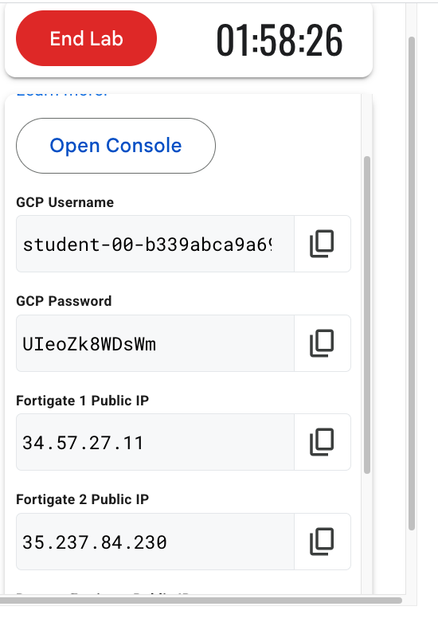
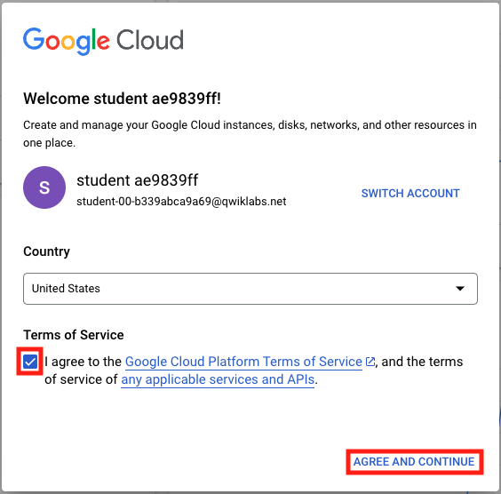
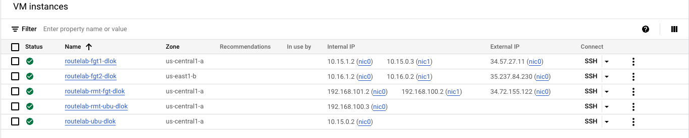

## Open Console

When your lab is fully provisioned, you will seee a list of student resources on the left panel.  This screen should be left up for the duration of the lab.  However, it is probably a good idea to copy and paste these values into your text editor for safe keeping.

- Right lick on **Open Console** and choose **Open Link in Incognito Window**

- This should populate your GCP student username into the "Email or phone" block.  If not, return to the student resources pane and copy the GCP username and paste it in.
- Click **Next**
- Copy the GCP password from the student resources pane and paste it into the "Enter your password" section.
- Click **Next**
- Click **I understand** on the Welcome page.
- This will take you to the Console Dashboard, but you have to agree to the terms of service by clicking the box and then clicking *AGREE AND CONTINUE**

### View VM Instances

Now we will look at the VMs resulting from the initial bootstrap of the environment.

- On the left side of the console, click **Compute Engine > VM instances** 
- You should see a list of 5 instances.  The names all start with routelab and end with random generated letters.  There are Three FortiGates listed. The first two "fgt1" and fgt2 are in the central and east GCP regions, respectively.  These are the devices that will become Network Connectivity Center (NCC) Spokes.  The remote fortigate "rmt-fgt" will emulate our remote site.  All of these have External (public) IP addresses assigned.  Confirm that these addresses match with the ones provided in the student resources pane.

### This chapter is complete!  Congratulations.  You can move to the next Chapter