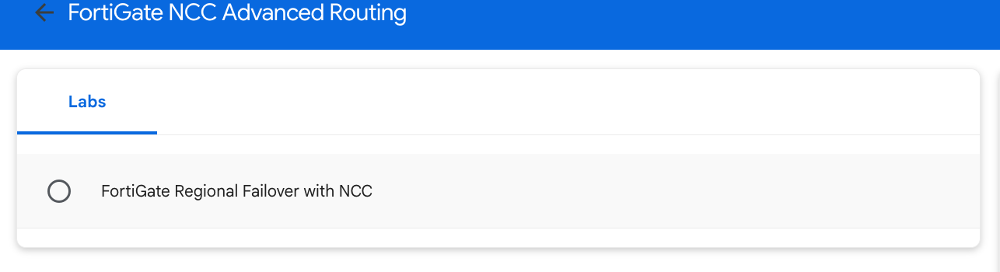
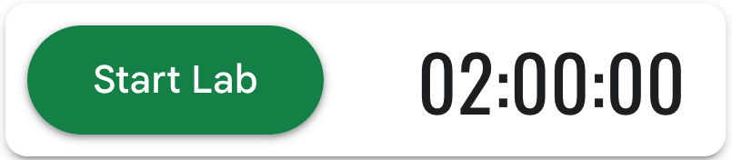

## ***Building your Environment(10 min)***

### Prereqs

- Web Browser - You are probably reading this page on your favorite Web Browser.  Feel free to keep using that.  For the qwiklab, you may want to use Firefox or Chrome if you experience issues.  It is **Highly recommended** to use **incognito or private** browswer mode to run the labs.
- Text Editor - While not strictly required, it will probably benefit you to have your favorite text editor up for the purposes of taking notes.  There will also be sections of these instructions where you are required to fill information before pasting code into FortiGate.
- Second Monitor - This is also not strictly required, but it will make moving back and forth between these instructions and the various GUI and console much easier.

### Select Lab

Once you have clicked the Lab icon on your Dashboard, you should see a screen like the one below.  **Click** on the lab.

### Start Lab

You should now see a **Start Lab** button with a timer.  **When you are ready** click on this button to start the lab.

{} Once you click the button, the timer will start counting down.  Be sure you have alotted enough time to complete the work.  At the end of the timer, the lab will be erased and you must begin again. {}

Once you click on the Start lab button, you will see that qwiklabs is provisioning the required resources.  Wait for this to finish and then proceed to the next step.

