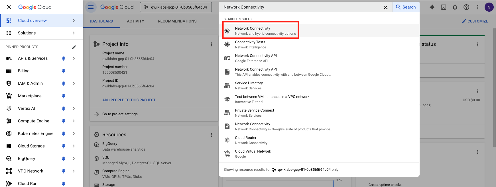
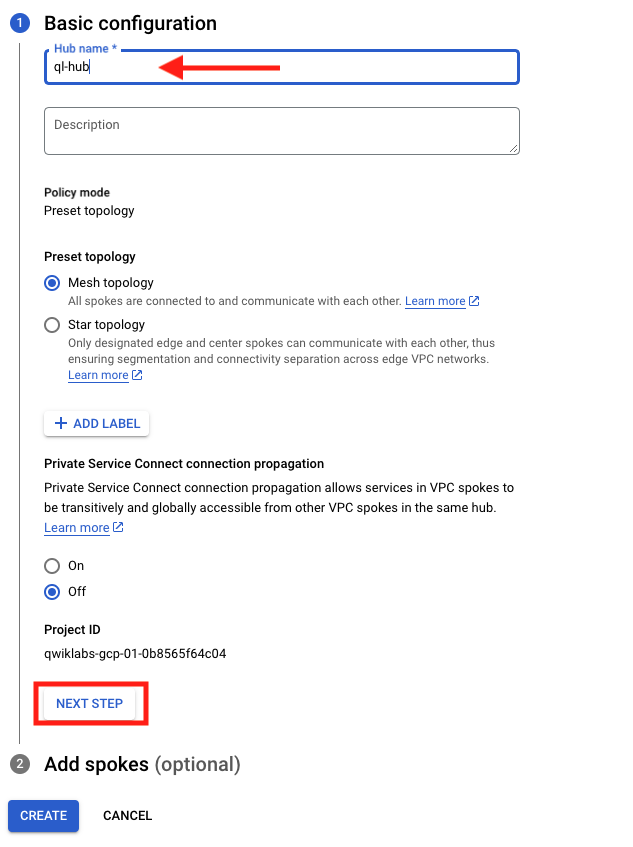
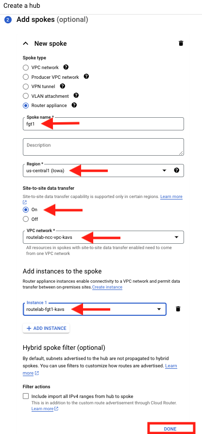
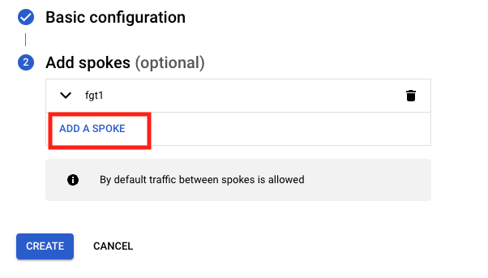
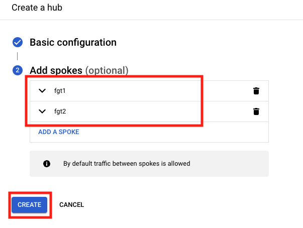

## Create NCC Hub

1. From the console, type ``` Network Connectivity ``` in the search bar.  One of the first options should be the Network Connectivity Center.  Click on that to move forward.

     

1. From the Network Connectivity Center screen, select **HUBS > CREATE HUB**
     - Provide a Name
     - Preset Topology will be **Mesh topology**
     - Private Service Connect Propagation will be **Off**
     - Click on **Next Step**

     

1. Add two spokes to the Hub
     - Now Click on **Add A SPOKE**
     - Spoke type will be **Router appliance**
     - Provide a Name that will make sense when troubleshooting.
     - Region will be **us-central1 (Iowa)**
     - Select **On** for Site-to-site data transfer
     - for VPC, we will choose **routelab-ncc-vpc-random**
     - Click on **ADD INSTANCE**
     - In the drop down, choose the FortiGate.  It will be named **routelabe-fgt1-random**
     - Click **Done**

     

     - Now you will Click **Add A Spoke** once more to add the FortiGate in US-EAST1

     

     - Repeat the process, but this time for region, choose **us-east1 (SouthCarolina)**
     - Now you should have two spokes to be added to the Hub.  Click on **CREATE**

     

### Proceed to the next section
    