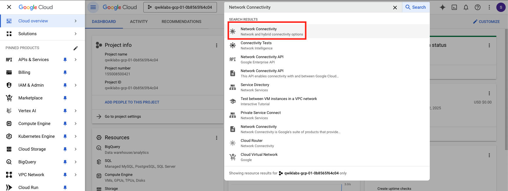
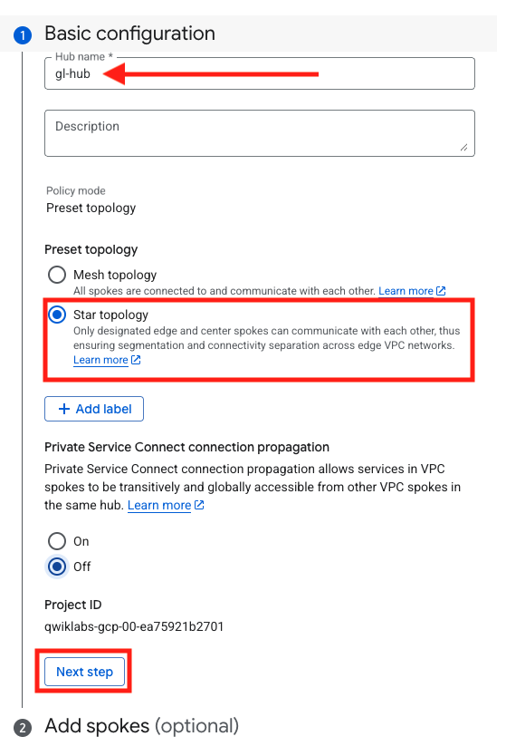
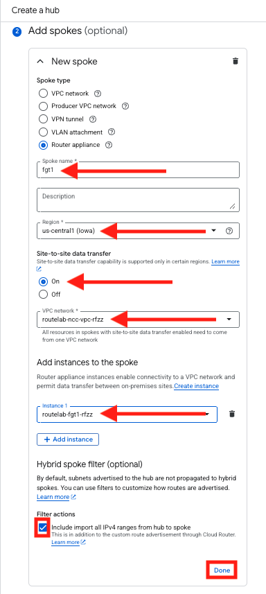
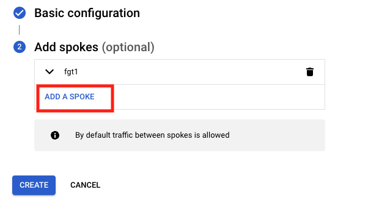
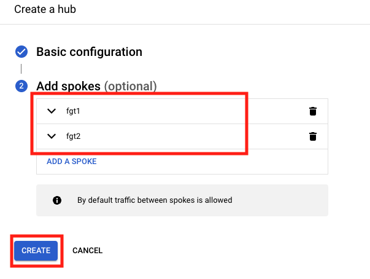

|                            |    |  
|----------------------------| ----
| **Goal**                   | Configure NCC Hub and spoke topology
| **Task**                   | Access NCC to create Hub and Spokes 
| **Verify task completion** | You should have two FortiGates acting as "center" spokes in a hub named ql-hub

## Create NCC Hub

1. From the console, type ``` Network Connectivity ``` in the search bar.  One of the first options should be the Network Connectivity Center.  Click on that to move forward.

     

1. From the Network Connectivity Center screen, select **HUBS > CREATE HUB**
     - Provide a Name
     - Preset Topology will be **Star topology**
     - Private Service Connect Propagation will be **Off**
     - Click on **Next Step**

     

     {} We will be configuring **two** router spokes.  There are two FortiGates deployed, one in us-central1 and one in us-east1. Each FortiGate will be a router spoke.{}

1. Add two spokes to the Hub
     - Now Click on **Add A SPOKE**
     - Spoke type will be **Router appliance**
     - Provide a Name that will make sense when troubleshooting.
     - **Spoke group** will be **center**
     - Region will be **us-central1 (Iowa)**
     - Select **On** for Site-to-site data transfer
     - for VPC, we will choose **routelab-ncc-vpc-random**
     - Click on **ADD INSTANCE**
     - In the drop down, choose the FortiGate.  It will be named **routelabe-fgt1-random**
     - Under Filter actions, click the checkbox to **Include import all IPv4 ranges from hub to spoke**
     - Click **Done**

     

     - Now you will Click **Add A Spoke** once more to add the FortiGate in US-EAST1

     

     - Repeat the process, but this time for region, choose **us-east1 (SouthCarolina)**
     - Now you should have two spokes to be added to the Hub.  Click on **CREATE**

     


### Discussion

In this task, we created the foundation of our secure transit network. We configured a Network Connectivity Center (NCC) Hub, which acts as a central point for managing traffic. We then added our two FortiGate Network Virtual Appliances (NVAs) from different regions (`us-central1` and `us-east1`) as spokes to this hub. By doing this, we've prepared our environment to use the FortiGates for centralized routing and security inspection for any traffic that flows through the NCC hub.

### Proceed to the next section
