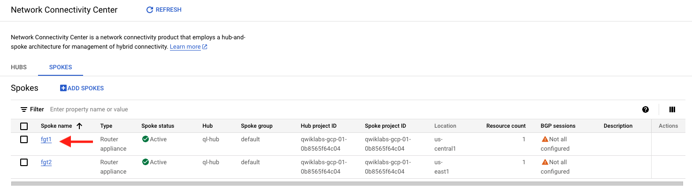
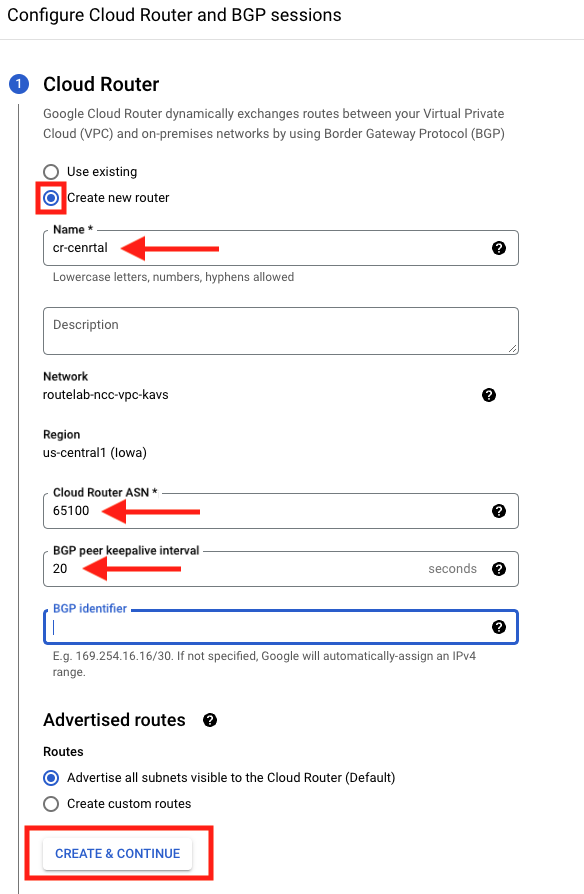
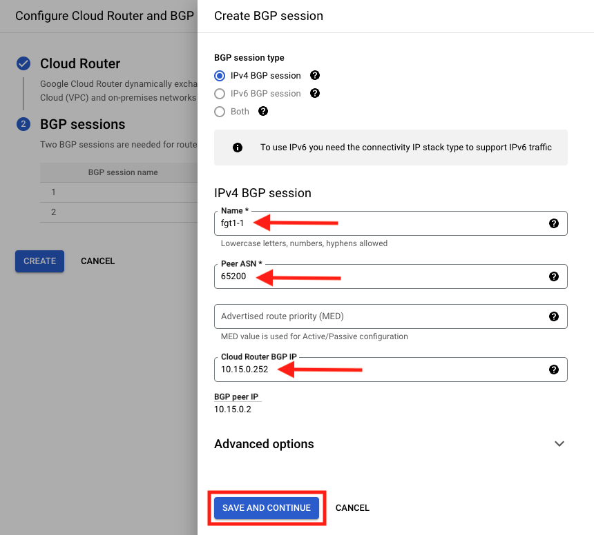
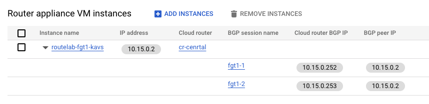
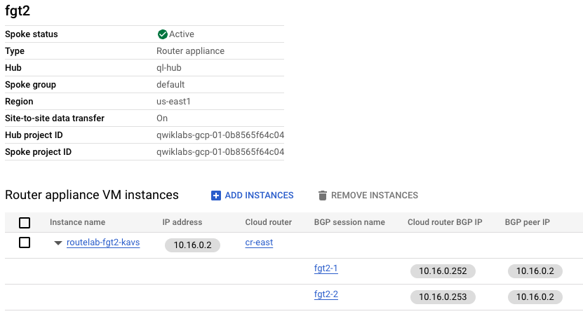

## Configure BGP for Spokes

After the previous section, we should now see a Hub and two Spokes in Network Connectivity Center.  In this section, we will configure BGP on these Spokes.  

1. Click on **Network Connectivity Center > SPOKES** and select the first spoke

1. Click the arrow next to the Instance name. And Click on **CONFIGURE BGP SESSION** . Notice that there are two sessions configure.  This provides redundancy in case of a failure.

![Spoke1]spoke1.png

1. Configure Cloud Router
     - For cloud router, select **Create new router**
     - Provide a Name
     - Provide an ASN. **This will need to be a different ASN than is used for FortiGate.** We will use 65100.
     - Set BGP peer keepalive interval to **20**
     - For BGP identifier, leave it blank.
     - Click on **CREATE & CONTINUE**

     

1. Configure BGP Sessions
     - Click on **EDIT BGP SESSION**
     - Select IPv4 BGP session
     - For Peer ASN, we will use **65200** (This will be the ASN confgired on FortiGate)
     - Leave Advertised route priority (MED) empty.
     - Cloud Router BGP IP for the first session will be **10.15.0.252**
     - Leave Advanced options as default
     - Click **SAVE AND CONTINUE**
     
     

     - Repeat for the second BGP session
          - The Cloud Router BGP IP for the second session will be **10.15.0.253**
     - When done click **SAVE AND CONTINUE**
     - Click **CREATE**
     - The end result will be two BGP Session configured for FortiGate one in the Central region

     

1. Return to **Network Connectivity Center > SPOKES** and repeat steps 1 and 2 above for the FortiGate in US-EAST1
     - All values will be the same with the below exceptions:
     - The names will need to be different
     - FortiGate BGP Session fgt2-1 will have Cloud Router BGP IP **10.16.0.252**
     - FortiGate BGP Session fgt2-1 will have cloud Router BGP IP **10.16.0.253**
     - The result should look like below:
     
     

### Proceed to the next section

