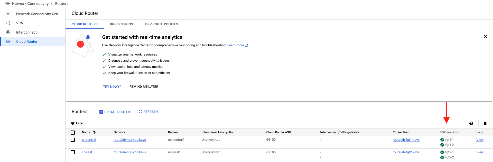

## Configure FortiGates

1. Log into FortiGate 1 using ``` ssh admin@<fortigate public ip> ``` password will be ```Fortinet1234$```

2. Copy the below configuration and paste it into the CLI

{} Ensure that the router-id used in the fortigate matches the IP address for port2.  This is usually .2, but is dynamically assigned by GCP {}

   FortiGate 1 (US Central) BGP Configuration:

   ```sh

   config router route-map
      edit nexthop1
         config rule
               edit 1
                  set set-ip-nexthop 10.15.0.252
                  unset set-ip-prefsrc
               next
         end
      next
      edit nexthop2
         config rule
               edit 1
                  set set-ip-nexthop 10.15.0.253
                  unset set-ip-prefsrc
               next
         end
      next
   end

   config router bgp
      set as 65200
      set router-id 10.15.0.2
      config neighbor
         edit 10.15.0.252
               set ebgp-enforce-multihop enable
               set soft-reconfiguration enable
               set remote-as 65100
               set route-map-in nexthop1
         next
         edit 10.15.0.253
               set ebgp-enforce-multihop enable
               set soft-reconfiguration enable
               set remote-as 65100
               set route-map-in nexthop2
         next
      end
   end

   ```

3. Confirm that the BGP peers have established by typing ``` get router info bgp summary ``` It should look similar to below:


   ```sh

   VRF 0 BGP router identifier 10.15.0.2, local AS number 65200
   BGP table version is 1
   1 BGP AS-PATH entries
   0 BGP community entries

   Neighbor    V         AS MsgRcvd MsgSent   TblVer  InQ OutQ Up/Down  State/PfxRcd
   10.15.0.252 4      65100       4       2        0    0    0 00:00:02        2
   10.15.0.253 4      65100       4       2        0    0    0 00:00:02        2

   Total number of neighbors 2


   ```

4. Look at received-routes using the commang ``` get router info bgp neighbor <neighbor ip> received-routes ``` You should see that we have recieved the CIDR block for the NCC Subnets in both us-central1 and us-east1

   ```sh

   fgt1 # get router info bgp neighbor 10.15.0.252 received-routes
   VRF 0 BGP table version is 1, local router ID is 10.15.0.2
   Status codes: s suppressed, d damped, h history, * valid, > best, i - internal
   Origin codes: i - IGP, e - EGP, ? - incomplete

      Network          Next Hop            Metric     LocPrf Weight RouteTag Path
   *> 10.15.0.0/24     10.15.0.1       100                    0        0 65100 ? <-/->
   *> 10.16.0.0/24     10.15.0.1       333                    0        0 65100 ? <-/->

   Total number of prefixes 2

   ```

5. Confirm that the remote route is installed into the route table in the CLI with the command ``` get router info routing-table all ``` 

   ```sh

      fgt1 # get router info routing-table all
   Codes: K - kernel, C - connected, S - static, R - RIP, B - BGP
         O - OSPF, IA - OSPF inter area
         N1 - OSPF NSSA external type 1, N2 - OSPF NSSA external type 2
         E1 - OSPF external type 1, E2 - OSPF external type 2
         i - IS-IS, L1 - IS-IS level-1, L2 - IS-IS level-2, ia - IS-IS inter area
         V - BGP VPNv4
         * - candidate default

   Routing table for VRF=0
   S*      0.0.0.0/0 [10/0] via 10.15.1.1, port1, [1/0]
   S       10.15.0.0/24 [10/0] via 10.15.0.1, port2, [1/0]
   C       10.15.0.2/32 is directly connected, port2
   C       10.15.1.2/32 is directly connected, port1
   B       10.16.0.0/24 [20/333] via 10.15.0.252 (recursive via 10.15.0.1, port2), 00:07:10, [1/0]  <--- 
   S       35.191.0.0/16 [10/0] via 10.15.0.1, port2, [1/0]
   S       130.211.0.0/22 [10/0] via 10.15.0.1, port2, [1/0]

   ```

6. **Repeat steps 1-5** for **FortiGate 2**

   FortiGate 2 (US East) BGP Configuration:

   ```sh

   config router route-map
      edit nexthop1
         config rule
               edit 1
                  set set-ip-nexthop 10.16.0.252
                  unset set-ip-prefsrc
               next
         end
      next
      edit nexthop2
         config rule
               edit 1
                  set set-ip-nexthop 10.16.0.253
                  unset set-ip-prefsrc
               next
         end
      next
   end

   config router bgp
      set as 65200
      set router-id 10.16.0.2
      config neighbor
         edit 10.16.0.252
               set ebgp-enforce-multihop enable
               set soft-reconfiguration enable
               set remote-as 65100
               set route-map-in nexthop1
         next
         edit 10.16.0.253
               set ebgp-enforce-multihop enable
               set soft-reconfiguration enable
               set remote-as 65100
               set route-map-in nexthop2
         next
      end
   end

   ```

7. Confirm BGP sessions in GCP by navigating to **Cloud Router** You should see two cloud routers and 4 BGP sessions (all green).



### This chapter is complete!  Congratulations.  You can move to the next Chapter