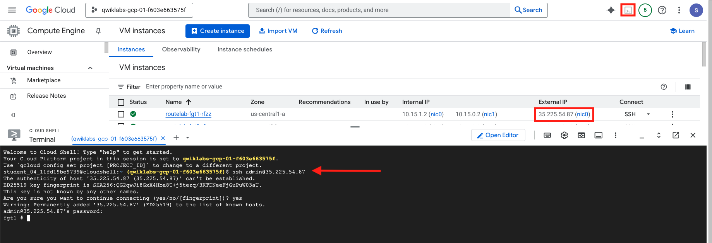
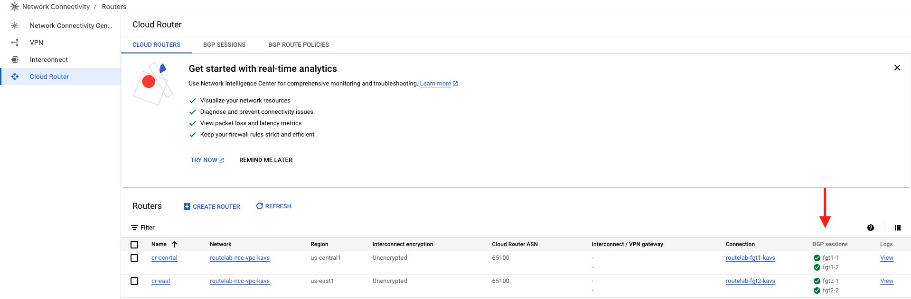

|                            |    |  
|----------------------------| ----
| **Goal**                   | Complete Fortigate peering setup
| **Task**                   | Log into Fortigates 1 and 2 and configure BGP for NCC Peering connections
| **Verify task completion** | You should have two established BGP connections in each FortiGate for their respective NCC Cloud Router Peers

## Configure FortiGates

1. Log into FortiGate 1 CLI:

{} The public IP of all FortiGates can be found in the studend resources section on the left side of the qwiklabs page where you started the lab.  See the **GCP Console** section of **Chapter 1 (Setup)**.  You can also see the **External IP** of each instance in the GCP Console under Compute Engine > VM instances {}

- If you have a favorite ssh application like putty (windows) or terminal (mac), ssh using ``` ssh admin@<fortigate public ip> ``` password will be ```Fortinet1234$```

- If not, go to the GCP Console and open a Cloud Shell terminal and issue the ssh command from there.



2. Copy the below configuration and paste it into the CLI

{} Ensure that the router-id used in the fortigate matches the IP address for port2.  This is usually .2, but is dynamically assigned by GCP {}

- You can get the internal ip address of port 2 from the fortigate CLI using the ``` get sys int physical port2 ``` command.

   FortiGate 1 (US Central) BGP Configuration:

   ```sh

   config router route-map
      edit nexthop1
         config rule
               edit 1
                  set set-ip-nexthop 10.15.0.252
                  unset set-ip-prefsrc
               next
         end
      next
      edit nexthop2
         config rule
               edit 1
                  set set-ip-nexthop 10.15.0.253
                  unset set-ip-prefsrc
               next
         end
      next
   end

   config router bgp
      set as 65200
      set router-id 10.15.0.2
      config neighbor
         edit 10.15.0.252
               set capability-default-originate enable
               set ebgp-enforce-multihop enable
               set soft-reconfiguration enable
               set remote-as 65100
               set route-map-in nexthop1
         next
         edit 10.15.0.253
               set capability-default-originate enable
               set ebgp-enforce-multihop enable
               set soft-reconfiguration enable
               set remote-as 65100
               set route-map-in nexthop2
         next
      end
   end

   ```

3. Confirm that the BGP peers have established by typing ``` get router info bgp summary ``` It should look similar to below:


   ```sh

   VRF 0 BGP router identifier 10.15.0.2, local AS number 65200
   BGP table version is 1
   1 BGP AS-PATH entries
   0 BGP community entries

   Neighbor    V         AS MsgRcvd MsgSent   TblVer  InQ OutQ Up/Down  State/PfxRcd
   10.15.0.252 4      65100       4       2        0    0    0 00:00:02        2
   10.15.0.253 4      65100       4       2        0    0    0 00:00:02        2

   Total number of neighbors 2


   ```

4. Look at received-routes using the commang ``` get router info bgp neighbor <neighbor ip> received-routes ``` You should see that we have recieved the CIDR block for the NCC Subnets in both us-central1 and us-east1

   ```sh

   fgt1 # get router info bgp neighbor 10.15.0.252 received-routes
   VRF 0 BGP table version is 1, local router ID is 10.15.0.2
   Status codes: s suppressed, d damped, h history, * valid, > best, i - internal
   Origin codes: i - IGP, e - EGP, ? - incomplete

      Network          Next Hop            Metric     LocPrf Weight RouteTag Path
   *> 10.15.0.0/24     10.15.0.1       100                    0        0 65100 ? <-/->
   *> 10.16.0.0/24     10.15.0.1       333                    0        0 65100 ? <-/->

   Total number of prefixes 2

   ```

5. Confirm that the remote route is installed into the route table in the CLI with the command ``` get router info routing-table all ``` 

   ```sh

      fgt1 # get router info routing-table all
   Codes: K - kernel, C - connected, S - static, R - RIP, B - BGP
         O - OSPF, IA - OSPF inter area
         N1 - OSPF NSSA external type 1, N2 - OSPF NSSA external type 2
         E1 - OSPF external type 1, E2 - OSPF external type 2
         i - IS-IS, L1 - IS-IS level-1, L2 - IS-IS level-2, ia - IS-IS inter area
         V - BGP VPNv4
         * - candidate default

   Routing table for VRF=0
   S*      0.0.0.0/0 [10/0] via 10.15.1.1, port1, [1/0]
   S       10.15.0.0/24 [10/0] via 10.15.0.1, port2, [1/0]
   C       10.15.0.2/32 is directly connected, port2
   C       10.15.1.2/32 is directly connected, port1
   B       10.16.0.0/24 [20/333] via 10.15.0.252 (recursive via 10.15.0.1, port2), 00:07:10, [1/0]  <--- 
   S       35.191.0.0/16 [10/0] via 10.15.0.1, port2, [1/0]
   S       130.211.0.0/22 [10/0] via 10.15.0.1, port2, [1/0]

   ```

6. **Repeat steps 1-5** for **FortiGate 2**

   FortiGate 2 (US East) BGP Configuration:

   ```sh

   config router route-map
      edit nexthop1
         config rule
               edit 1
                  set set-ip-nexthop 10.16.0.252
                  unset set-ip-prefsrc
               next
         end
      next
      edit nexthop2
         config rule
               edit 1
                  set set-ip-nexthop 10.16.0.253
                  unset set-ip-prefsrc
               next
         end
      next
   end

   config router bgp
      set as 65200
      set router-id 10.16.0.2
      config neighbor
         edit 10.16.0.252
               set capability-default-originate enable
               set ebgp-enforce-multihop enable
               set soft-reconfiguration enable
               set remote-as 65100
               set route-map-in nexthop1
         next
         edit 10.16.0.253
               set capability-default-originate enable
               set ebgp-enforce-multihop enable
               set soft-reconfiguration enable
               set remote-as 65100
               set route-map-in nexthop2
         next
      end
   end

   ```

7. Confirm BGP sessions in GCP by navigating to **Cloud Router** You should see two cloud routers and 4 BGP sessions (all green).



### Discussion

In this final configuration step, we completed the BGP peering from the FortiGate side. We logged into each FortiGate appliance and applied the necessary BGP configuration to establish a connection with the GCP Cloud Routers. By verifying the BGP session status and the received routes on both the FortiGates and in the GCP console, we have now confirmed that our secure transit network is fully operational and ready to dynamically exchange routing information.

### Chapter Summary

Congratulations on completing this chapter! You have successfully built a robust and secure transit network foundation using GCP's Network Connectivity Center and FortiGate NVAs.

*   **Task 1: Create NCC Hub:** We started by creating a central NCC Hub and attaching our regional FortiGates as spokes, establishing the core hub-and-spoke topology.
*   **Task 2: Configure Spokes:** We then configured the GCP side of the connection by creating Cloud Routers for each spoke and defining the parameters for the BGP sessions.
*   **Task 3: Configure FortiGate BGP:** Finally, we configured the FortiGate appliances to peer with the GCP Cloud Routers, enabling dynamic route exchange between your VPCs and the security appliances.

Your network is now ready for the next steps, where we will build an IPsec overlay and configure security policies.

### You can move to the next Chapter.