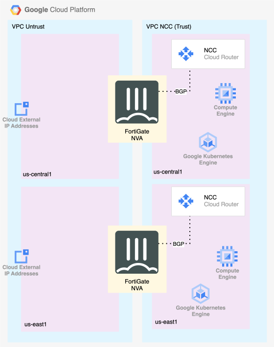

## ***Build Hub and Spoke Architecture in GCP NCC- estimated duration 30 min***

### Why NCC?

> GCP's **Network Connectivity Center (NCC)** acts as a central hub for managing network connectivity across your entire cloud and on-premises infrastructure. It uses a "hub-and-spoke" model where your various networks—like different Virtual Private Clouds (VPCs), on-premises data centers (via VPN or Interconnect), and even other cloud provider networks—connect to a single, managed hub. This simplifies network management and allows for dynamic route exchange using BGP, enabling seamless communication between any connected spoke.
>
> A **Router Appliance like FortiGate** is incredibly useful in this architecture because it functions as a "super-spoke." While GCP provides basic routing, a FortiGate Network Virtual Appliance (NVA) adds a critical layer of advanced security and traffic control. By routing traffic through a FortiGate spoke, you can:
>
> *   **Inspect Traffic:** Apply next-generation firewall (NGFW) policies, including Intrusion Prevention (IPS), antivirus, and web filtering, to all traffic passing between VPCs or between your cloud and on-premises environments.
> *   **Enable Secure SD-WAN:** Extend your corporate SD-WAN fabric directly into the cloud for consistent policy enforcement and optimized connectivity.
> *   **Centralize Security:** Enforce a unified security posture across your entire hybrid network, inspecting and securing all data flows from a single point of control.
>
> In short, NCC provides the connectivity framework, while FortiGate provides the advanced security and inspection needed to protect it.

**The below image reresents part of the environment that was built during bootstrap. In this chapter, students will configure the NCC Hub and a spoke for each FortiGate (fgt1, fgt2).  Students will then configure BGP on the FortiGates in order to exchange routing information with the NCC Cloud Router.  Each FortiGate is deployed with vNICs in two VPCs (untrust and trust).  We will be configuring our BGP sessions on the trust interfaces in FortiGate.  This will allow dynamic routing to all internal GCP resources across both regions.**

