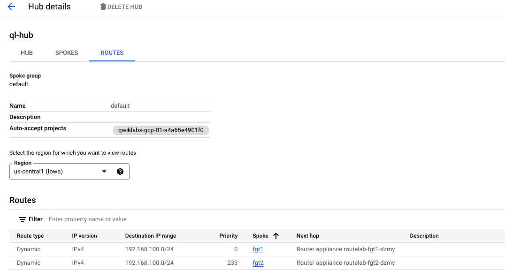
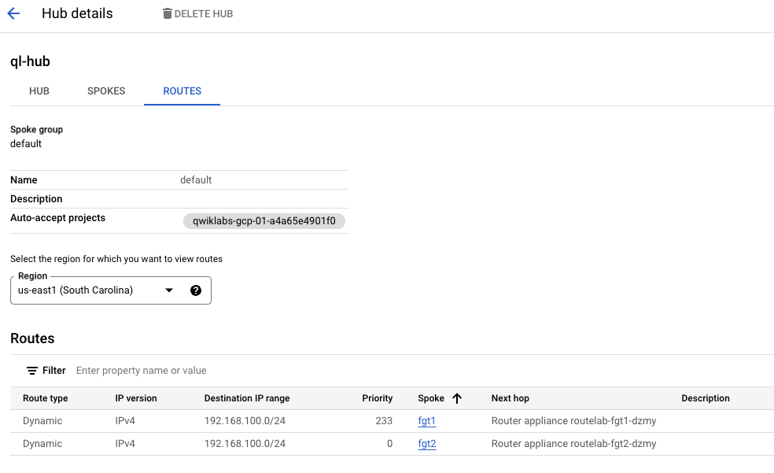

## Check BGP Routing

1. Check FortiGate routing.

    - Useful CLI Commands

    ```sh

    get router info routing-table bgp
    get router info routing-table all
    get router info bgp summary
    get router info bgp neighbors <neighbor IP> received-routes
    get router info bgp neighbors <neighbor IP> advertised-routes
    get router info routing-table details <prefix>
    
    ```

    - As we can see below, we are installing the routes from the remote FortiGates.  We see 10.15.0.0/24 will traverse tunnel FGT-1 (us-central1) and 10.16.0.0/24 will traverse tunnel FGT-2 (us-east1).  This is the ideal scenario since traffic will be forwarded to the FortiGate directly in the region where the subnets are configured.  This eliminates inter-regional routing on GCP's network, during normal operation, saving the customer network costs.  

    ```sh

    rmt-fgt # get router info routing-table bgp
    Routing table for VRF=0
    B       10.15.0.0/24 [200/100] via 10.17.1.2 (recursive via FGT-1 tunnel 35.225.97.223), 00:24:28, [1/0]
    B       10.16.0.0/24 [200/100] via 10.17.2.2 (recursive via FGT-2 tunnel 34.74.104.177), 00:23:28, [1/0]

    ```

    - Let's verify that we are receiving both routes from both peers.  In the event that one of the FortiGates becomes unreachable, we should install the less desireable route from the other FortiGate.

    ```sh

    rmt-fgt # get router info bgp neighbors 10.17.1.2 received-routes 
    VRF 0 BGP table version is 2, local router ID is 192.168.101.2
    Status codes: s suppressed, d damped, h history, * valid, > best, i - internal
    Origin codes: i - IGP, e - EGP, ? - incomplete

    Network          Next Hop            Metric     LocPrf Weight RouteTag Path
    *>i10.15.0.0/24     10.17.1.2       100           100      0        0 65100 ? <-/->
    *>i10.16.0.0/24     10.17.1.2       333           100      0        0 65100 ? <-/->

    Total number of prefixes 2


    rmt-fgt # get router info bgp neighbors 10.17.2.2 received-routes
    VRF 0 BGP table version is 2, local router ID is 192.168.101.2
    Status codes: s suppressed, d damped, h history, * valid, > best, i - internal
    Origin codes: i - IGP, e - EGP, ? - incomplete

    Network          Next Hop            Metric     LocPrf Weight RouteTag Path
    *>i10.15.0.0/24     10.17.2.2       333           100      0        0 65100 ? <-/->
    *>i10.16.0.0/24     10.17.2.2       100           100      0        0 65100 ? <-/->

    Total number of prefixes 2

    ```

    - As we can see from the above output, we are getting both routes from both peers. We are preferring the route with the lower metric as expected.

2.  Check BGP Routing in NCC by navigating to **Network Connectivity Center > select your hub name > ROUTES**

    - Let's check **us-central1 (Iowa)** region first.

    

    - We can see the route learned from the local FortiGate (fgt1) has a lower priority.  According to this [link](https://cloud.google.com/network-connectivity/docs/router/concepts/learned-routes), route priority is treated like MED, meaning that the lowest value is preferred.

    - Let's check **us-east1 (South Carolina)** region next.

    

    - In this case, the lower priority value is assigned to the route learned from the local FortiGate (fgt2).  
    
{} In our environment, we are using SNAT in the FortiGate Policy, meaning that traffic will always return to the FortiGate from which it was recieved. However, in some situations, that is not desirable.  As we have seen, the route priorities causing the local FortiGate to be preferred should prevent asymmetrical routing when both devices are up.{}
    

### This chapter is complete!  Congratulations.  You can move to the next Chapter
