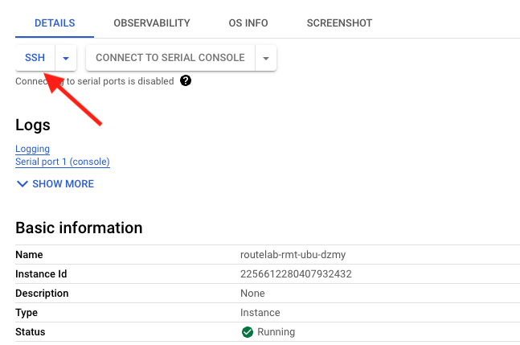
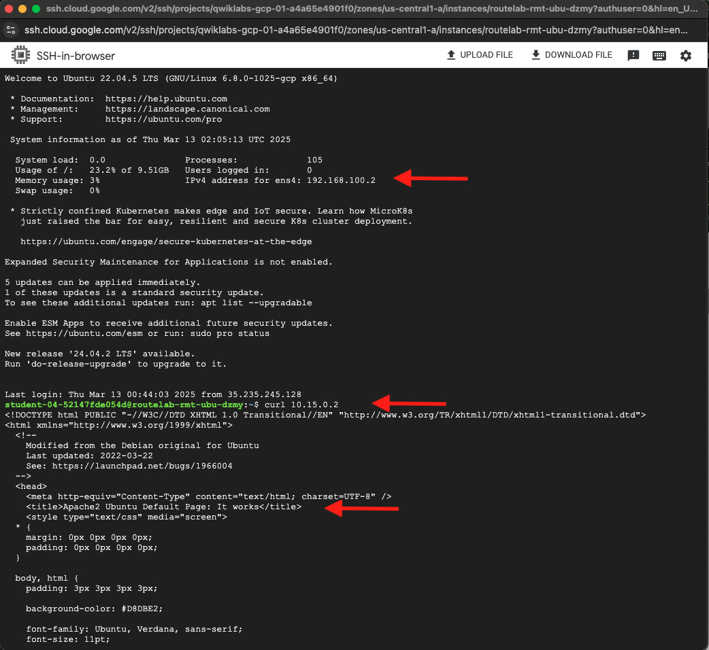
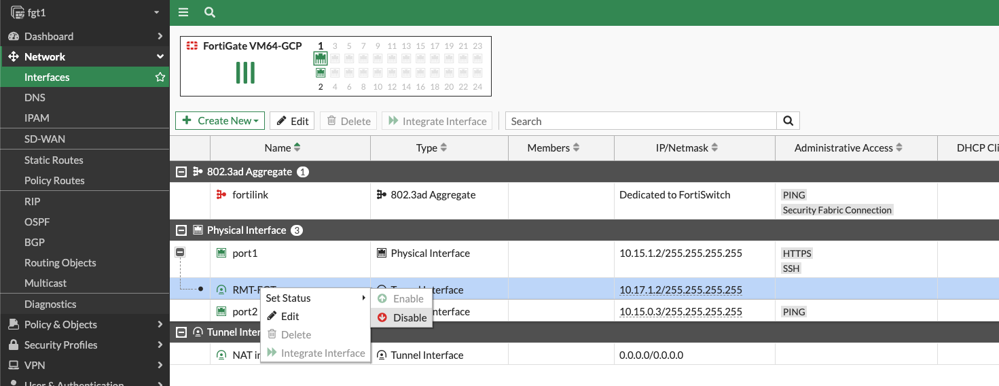
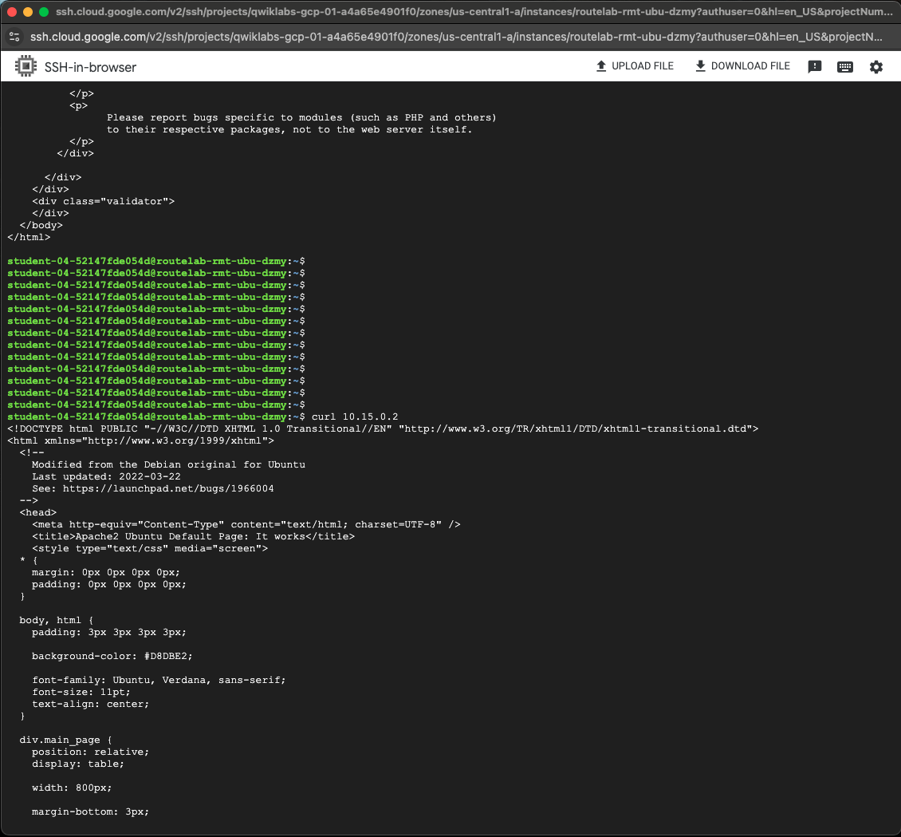

## Test Failover

As we saw previously, the remote fortigate was preferring the route over tunnel FGT-1 for the 10.15.0.0/24 subnet.

1. Before we perform the failover, let's log into our remote GCP Ubuntu instance and curl the Ubuntu instance in us-central1 to verify continuity.

    - From the GCP console, Navigation Menu select **Compute Engine > VM instances**
    - click on the VM named **routelab-rmt-ubu-**random"
    - On the DETAILS tab, click on **SSH** at the top of the screen

    

    - If asked to do so, athorize. On the SSH-in-browswer window that pops up, you will notice the ip address of the device 192.168.100.x and you should see a prompt.  At the prompt type ``` curl <Ubuntu IP> ``` The default curl port is http 80, which we enabled earlier in our policy. You should see the standard Apache2 Default page, indicating that it works.

    

2. Now let's Log into FortiGate1 (fgt1) by typing ``` https://fortigate1-ip:8443 ``` the username is ``` admin ``` and the password is ``` Fortinet1234$ ```

    - Navigate to **Network > Interfaces** and hit the "+" sign next to port1
    - Right click on **RMT-FGT** tunnel interface and select **Set Status > Disable**

    

3. Navigate to the cli of the remote FortiGate and check that routing for 10.15.0.0/25 is now traversing tunnel FGT-2

    ```sh

    rmt-fgt # get router info routing-table bgp
    Routing table for VRF=0
    B       10.15.0.0/24 [200/333] via 10.17.2.2 (recursive via FGT-2 tunnel 34.74.104.177), 00:00:03, [1/0]
    B       10.16.0.0/24 [200/100] via 10.17.2.2 (recursive via FGT-2 tunnel 34.74.104.177), 02:04:25, [1/0]

    ```

    - As we can see, the route is failed over

4. Return to SSH-in-browser and confirm that we can still reach our ubuntu server in us-central1

    

{} Notice that we are using BFD for the BGP sessions over IPSec.  When I was first testing this, failing the IPSec tunnel resulted in a 3 minute black holing of traffic.  This was because we had to wait for the default BGP neighbor timers to expire before withdrawing the route.  During that time,the IPSec tunnel was down, so the original BGP route had a bad next hop, meaning that we ended up using the default out to the internet.  I enabled BFD to solve this problem.  When BFD is in use, for BGP, we recognize the neighbor down much more quickly.  The result was nearly instant failover to FGT-2 tunnel.  BGP neighbor timers can be configured, to reduce failover time, but this is not as fast as BFD.{}

### This lab is complete!  Congratulations!