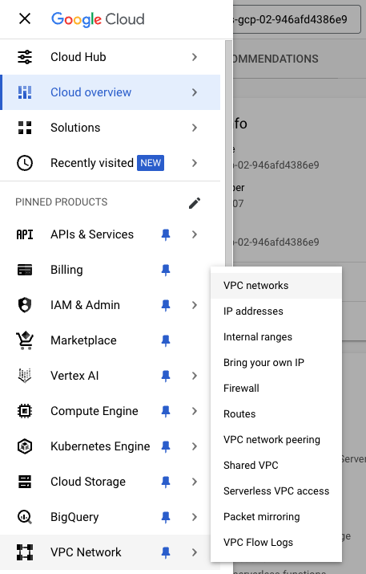
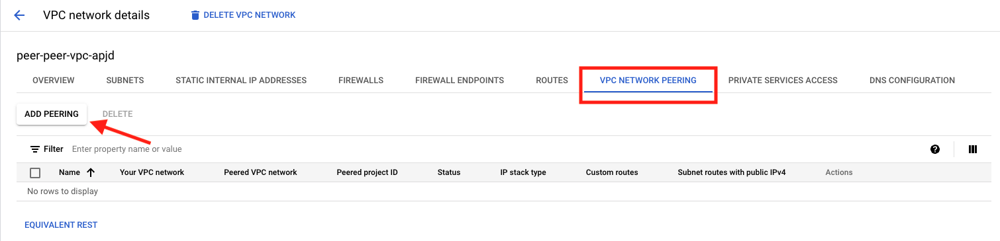
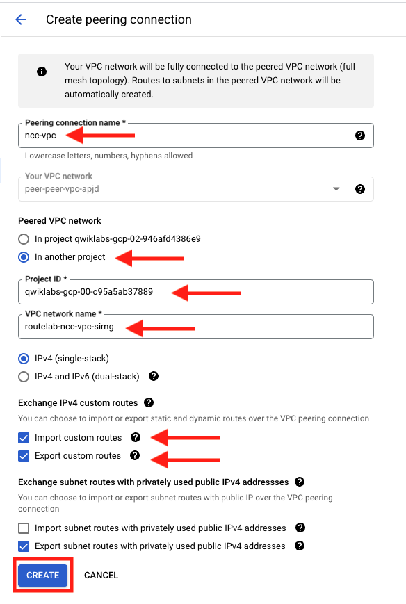

## Configure VPC Peering on Application VPC

During bootstrap of this environment, a separate project containing an application VPC was configured with an Ubuntu VM.  For this exercise, we will log into that project and create a VPC peering configuration for our NCC Trust VPC.

1. Log into the Project Containing the application VPC

    When you opened the console during the initial setup of this lab, you were logged into the project containing the FortiGates and all of the networking components requi to build the overlay.  We need to log into the application project.

    - From the top of the screen, click on the current project ID.  This will open the **Select Project** popup window.
    - Click on the **ALL** tab.
    - Next, click on the other project ID.  

    {} If you are unclear what which project this is, you can go to the Student Information pane on the left of the screen in qwiklabs and see the Application VPC ID {}
    

1. Now that you are logged into the Application project You will need to navigate to the VPC

    - Click on the Navigation window icon at the top left of the screen.
    - Click through **VPC Network** > **VPC networks**

    

1. Configure Peering
    - click on the peer vpc under "VPC networks"
    - On the VPC network details screen, select the **VPC NETWORK PEERING** tab and then click **ADD PEERING**
    
        - Peering connection name = **ncc-vpc**
        - select **In another project**
        - enter NCC project ID
        - enter NCC network name
        - select **Import** and **Export** custom routes
        - leave everything else as default
        - click **CREATE**
    
    

### Proceed to the next section