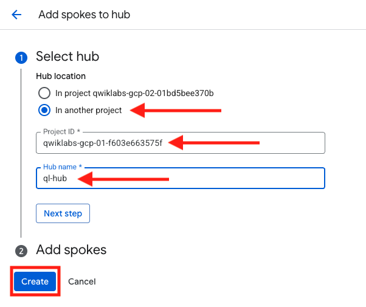
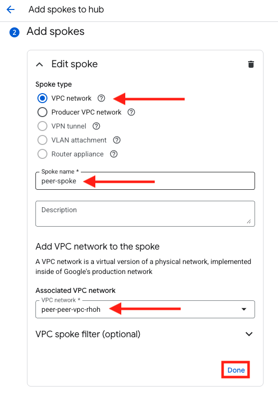
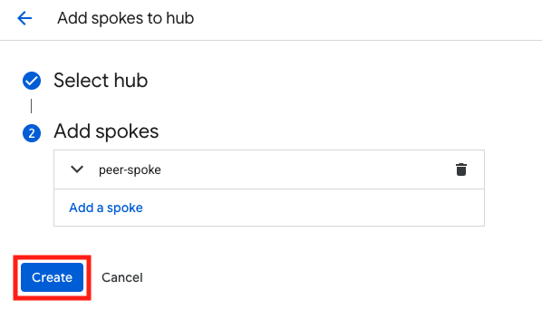

## Configure VPC Peering on Application VPC

During bootstrap of this environment, a separate project containing an application VPC was configured with an Ubuntu VM.  For this exercise, we will log into that project and create a VPC spoke

1. Log into the Project Containing the application VPC

    When you opened the console during the initial setup of this lab, you were logged into the project containing the FortiGates and all of the networking components requi to build the overlay.  We need to log into the application project.

    - From the top of the screen, click on the current project ID.  This will open the **Select Project** popup window.
    - Click on the **ALL** tab.
    - Next, click on the other project ID.  

    {} If you are unclear what which project this is, you can go to the Student Information pane on the left of the screen in qwiklabs and see the Application VPC ID {}
    

1. Now that you are logged into the Application project You will need to navigate to Network Connectivity Center

    - Click on *Add spokes**
    - Since we are adding a spoke here and not a hub, we will need to indicate the Hub name and project ID for our other project
    - Once added, click **Create**

    

1. Configure Spoke
    - now that we have designated our Hub, we will need to create the spoke for our local network
    - Spoke type will be **VPC network**
    - Spoke name is arbitrary, we can go with peer-spoke, or some other name that will make sense to you later
    - Associated VPC network will be our local VPC (there is only one option in this case)
    - Leave everything else as default and select **Done**

    

    - Once complete, click **Create**

    

1. Verify that peer is created
    - Now open the **Spokes** tab and verify that your peer is in **Inactive, pending review** state

   

### Proceed to the next section
