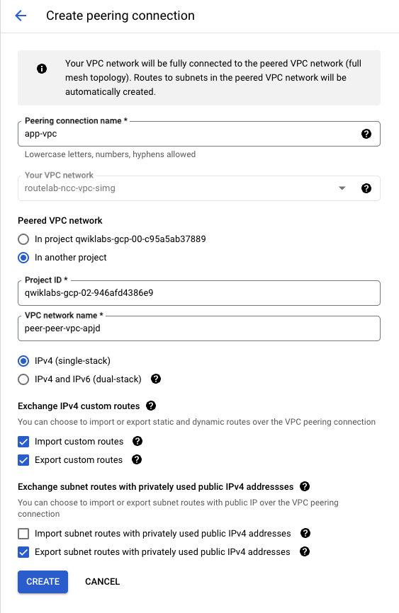
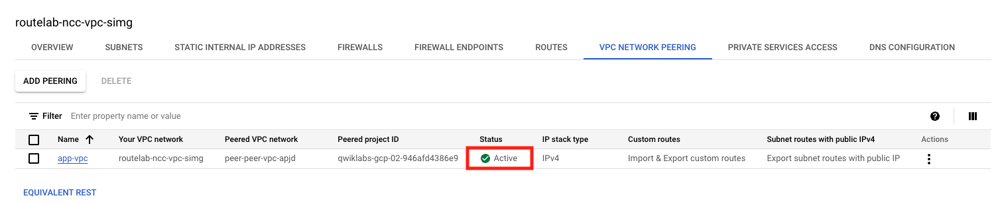

## Configure VPC Peering on NCC VPC

Now, let's configure VPC Peering on the NCC VPC

1. Log back into the Project Containing the NCC VPC and navigate to 

    - Click on the Navigation window icon at the top left of the screen.
    - Click through **VPC Network** > **VPC networks**

1. Configure Peering
    - click on the **ncc** vpc under "VPC networks"
    - On the VPC network details screen, select the **VPC NETWORK PEERING** tab and then click **ADD PEERING**
        - Peering connection name = **app-vpc**
        - select **In another project**
        - enter Application project ID
        - enter Peer network name
        - select **Import** and **Export** custom routes
        - leave everything else as default
        - click **CREATE**
    

1. Confirm that Peer Status is Active

    Now that peering is configured on both ends, we need to verify that the status comes up as active.
    

### Proceed to the next section