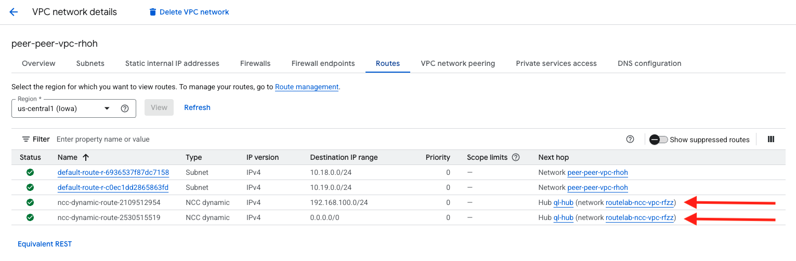

## Check NCC VPC Routing Table

1. Now that we have the spoke configured, we need to go back to the Application project and delete the default route which is configuredfor the peer-vpc This route will take precedence over the default being advertised by FortiGate.
    - Navigate to VPC Network > Routes > Route Management
    - select the box next to the default route assosicated with the peer network.
    - Click **Delete**

1. Verify routing in the peer vpc.
    - Click on the Effective routes tab and chose the peer vpc for region **us-central1** and click **view**
    - Verify that we see the route from the Remote FortiGate as well as the default pointing to our NCC vpc.

    

1. Verify routing in the FortiGate.
    - Access FortiGate CLI and verify that we see **10.18.0.0/24** and **10.19.0.0/24**

```sh
fgt1 # get router info bgp summary 

VRF 0 BGP router identifier 10.15.0.2, local AS number 65200
BGP table version is 6
2 BGP AS-PATH entries
0 BGP community entries

Neighbor    V         AS MsgRcvd MsgSent   TblVer  InQ OutQ Up/Down  State/PfxRcd
10.15.0.252 4      65100     879    1009        6    0    0 01:30:43        4
10.15.0.253 4      65100     870     997        6    0    0 04:48:10        4
10.17.1.1   4      65200     140     146        6    0    0 02:01:38        1

Total number of neighbors 3


fgt1 # get router info routing-table bgp
Routing table for VRF=0
B       10.16.0.0/24 [20/333] via 10.15.0.253 (recursive via 10.15.0.1, port2), 04:48:21, [1/0]
B       10.18.0.0/24 [20/100] via 10.15.0.253 (recursive via 10.15.0.1, port2), 01:45:13, [1/0]
B       10.19.0.0/24 [20/333] via 10.15.0.253 (recursive via 10.15.0.1, port2), 01:45:13, [1/0]
B       192.168.100.0/24 [200/0] via 10.17.1.1 (recursive via RMT-FGT tunnel 35.188.153.216), 02:01:26, [1/0]


fgt1 # 
```
