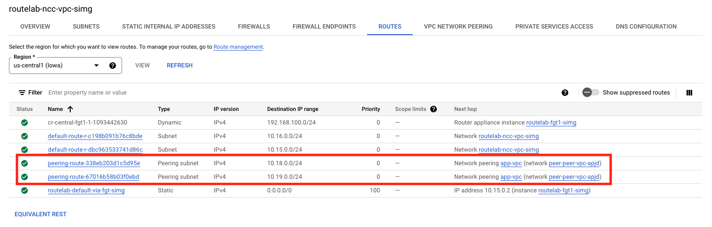
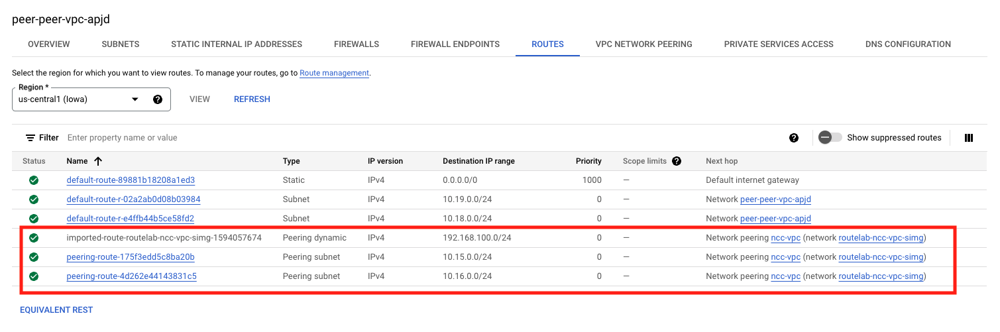
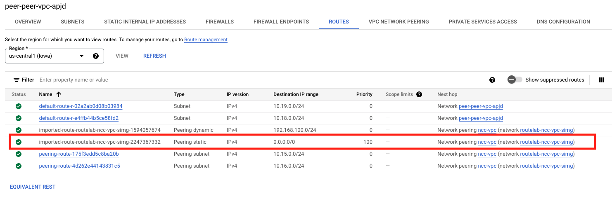

## Check NCC VPC Routing Table

While still on the VPC network details screen for the NCC VPC, let's check on routing.

1. Click on the **ROUTES** tab and select the **us-central1 (Iowa)** region
    - Click **View**
    - Verify that the **10.18.0.0/24** and **10.19.0.0/24** routes are present and the Next hop is the Peering connection that you just created.
    

1. Navigate to the Application project and VPC.
    - click on the **peer** vpc under "VPC networks"
    - click on the **ROUTES** tab and select the **us-central1 (Iowa)** region
    - click **View**
    
    - Notice that we have received 3 routes
        2 @ "peering-route"
        These are the CIDRs for the two subnets in the NCC VPC.
            - 10.15.0.0/24
            - 10.16.0.0/24
        1 @ "imported-route"
        This is the route that NCC learned via BGP from our FortiGate
            - 192.168.100.0/24

1. Look at the above pictured route table and notice the "default-route" for this region is pointing to the "Default internet gateway" as it's Next hop.
    This presents a problem.  We need to route all traffic across our newly created VPC Peering link so that FortiGate can provide security.
    - click on the **default-route** to open the details
    - click **DELETE**
    - navigate back to the routing table and notice that we have now imported the default route from the NCC VPC
    

{} It's worth noting that the terraform used to create this environment included a fireall rule to allow ALL ingress traffic from 10.0.0.0/8. If this were not in place, you would need to add it.  You can check the Firewall rules by clicking on the **FIREWALLS** tab {}

### Proceed to the next section