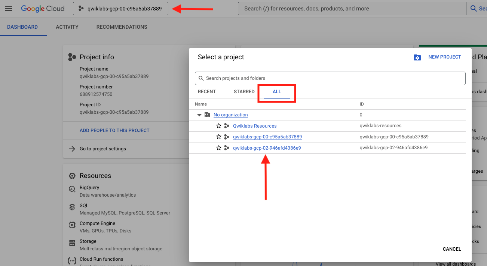
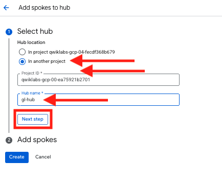
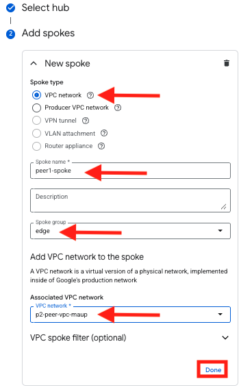
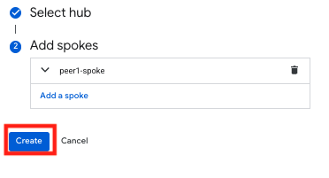
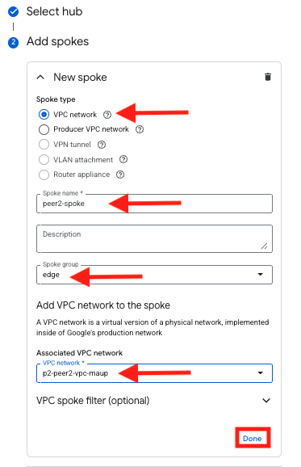
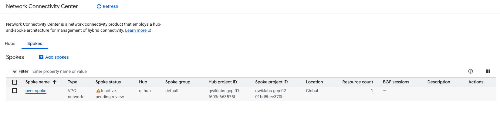

|                            |    |  
|----------------------------| ----
| **Goal**                   | Configure NCC Spoke proposal in Application Project
| **Task**                   | Log into GCP NCC in Application project and configure spoke proposal 
| **Verify task completion** | You should have two spokes in the Application project which are inactive, pending review

## Configure VPC Peering on Application VPC

During bootstrap of this environment, a separate project containing two application VPCs was configured with an Ubuntu VM in each.  For this exercise, we will log into that project and create a VPC spoke for each of those.

1. Log into the Project Containing the application VPC

    When you opened the console during the initial setup of this lab, you were logged into the project containing the FortiGates and all of the networking components required to build the overlay.  We need to log into the application project.

    - From the top of the screen, click on the current project ID.  This will open the **Select Project** popup window.
    - Click on the **ALL** tab.
    - Next, click on the other project ID.  

    {} If you are unclear what which project this is, you can go to the Student Information pane on the left of the screen in qwiklabs and see the **Peered Project ID** {}
    

1. Now that you are logged into the Application project You will need to navigate to Network Connectivity Center

    - Click on *Add spokes**
    - Since we are adding a spoke here and not a hub, we will need to indicate the Hub name and project ID for our other project
    - Once added, click **Next step**

    

1. Configure Spoke
    - Now that we have designated our Hub, we will need to create the spoke for our local network
    - Spoke type will be **VPC network**
    - Spoke name is arbitrary, we can go with peer1-spoke, or some other name that will make sense to you later
    - Spoke group name will be **edge**
    - Associated VPC network will be **p2-peer-vpc-random**
    - Leave everything else as default and select **Done**

    

    - Now click on **Create** to create the spoke

    

    - Now open the **Spokes** tab and verify that your peer is in **Inactive, pending review** state

    - Repeat for the second VPC
    - Click **Add spokes**
    - Spoke name will be **peer2-spoke**
    - VPC will be named named **p2-peer2-vpc-random**
    - Once complete, click **Done**

    

    - Click **Create**

1. Verify that 2 inactive peers are created
    - Open the **Spokes** tab and verify that your peer is in **Inactive, pending review** state

   

### Proceed to the next section
