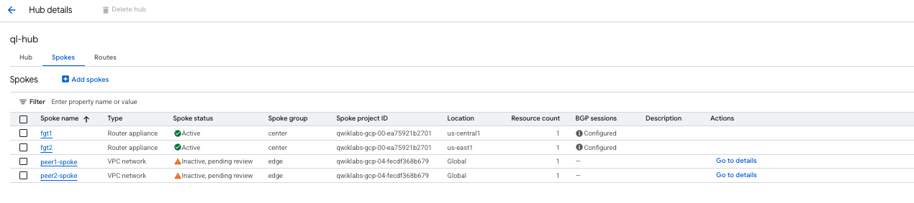
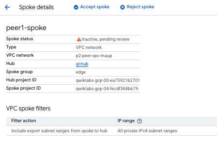
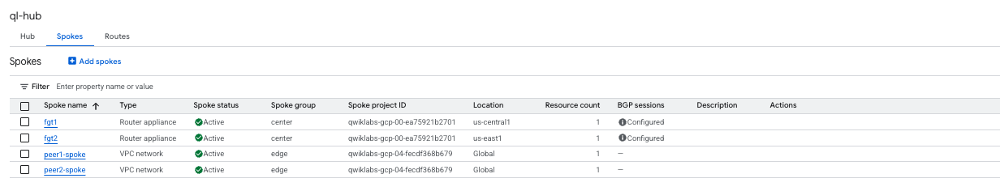

## Configure Application Spoke in NCC Network

Navigate to the original NCC project 

1. Navigate to Network Connectivity Center

    - Click on the **Spokes** tab
    - Verify that you see the peer spoke you created previously in **Inactive, pending review** state
    

1. Accept Peer Spoke
    - Click on the peer-spokes in order to see the details screen.
    - At the top of the screen, we will see an option to Accept or Reject.  Click on **Accept**.
    - Repeat for both spokes

    

1. Confirm that the spokes become active.

    

### Proceed to the next section
