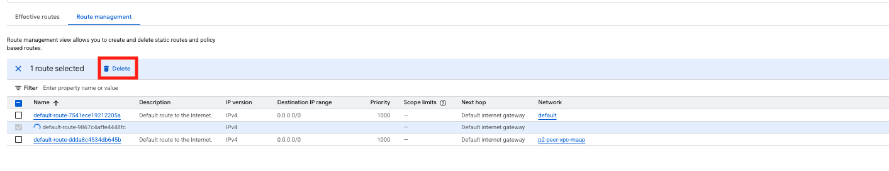
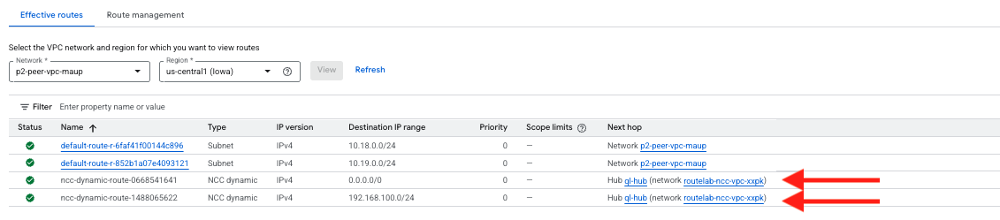

|                            |    |  
|----------------------------| ----
| **Goal**                   | Verify Routing
| **Task**                   | Delete default routes in application VPCs and confirm routes from FortiGate
| **Verify task completion** | You should have a default route and a route for the remote site from FortiGate in the effective routes sectiom

## Check NCC VPC Routing Table

1. Now that we have the spoke configured, we need to go back to the Application project and delete the default route which is configured for **both** of the the peer-vpc networks. These routes are pointing to the Default Internet Gateway and will take precedence over the default being advertised by FortiGate.

    - Navigate to VPC Network > Routes > Route Management
    - select the box next to the default route assosicated with the peer networks.
    - Click **Delete**

    

1. Verify routing in the peer vpc.
    - Click on the Effective routes tab and chose the peer vpcs for region **us-central1** and click **view**
    - Verify that we see the route from the Remote FortiGate as well as the default pointing to our NCC vpc.

    


1. Verify routing in the FortiGate.
    - Access FortiGate CLI and verify that we see **10.18.0.0/24**, **10.19.0.0/24**, **10.20.0.0/24** and **10.21.0.0/24**

```sh
fgt1 # get router info bgp summary

VRF 0 BGP router identifier 10.15.0.3, local AS number 65200
BGP table version is 4
2 BGP AS-PATH entries
0 BGP community entries

Neighbor    V         AS MsgRcvd MsgSent   TblVer  InQ OutQ Up/Down  State/PfxRcd
10.15.0.252 4      65100     189     221        4    0    0 01:00:56        6
10.15.0.253 4      65100     189     212        2    0    0 01:00:57        6
10.17.1.1   4      65200      65      70        4    0    0 00:55:29        1

Total number of neighbors 3


fgt1 # get router info routing-table bgp
Routing table for VRF=0
B       10.16.0.0/24 [20/333] via 10.15.0.253 (recursive via 10.15.0.1, port2), 01:01:06, [1/0]
B       10.18.0.0/24 [20/100] via 10.15.0.253 (recursive via 10.15.0.1, port2), 00:04:50, [1/0]
B       10.19.0.0/24 [20/333] via 10.15.0.253 (recursive via 10.15.0.1, port2), 00:04:50, [1/0]
B       10.20.0.0/24 [20/100] via 10.15.0.253 (recursive via 10.15.0.1, port2), 00:02:55, [1/0]
B       10.21.0.0/24 [20/333] via 10.15.0.253 (recursive via 10.15.0.1, port2), 00:02:55, [1/0]
B       192.168.100.0/24 [200/0] via 10.17.1.1 (recursive via RMT-FGT tunnel 34.121.250.35), 00:55:15, [1/0]


fgt1 # 
```

### Discussion

In this crucial task, we redirected all outbound traffic from our application VPCs to flow through our FortiGate security appliances. To achieve this, we first deleted the default routes in the application VPCs that pointed directly to the internet. This action forces the VPCs to honor the new default route being advertised by the FortiGates via the Network Connectivity Center.

We then verified the routing from two perspectives:
1.  **From the GCP VPC:** We checked the "Effective routes" for our application VPCs and confirmed they had learned the default route (`0.0.0.0/0`) and the route to the remote on-premises network, both pointing towards the NCC hub.
2.  **From the FortiGate:** We inspected the BGP routing table on the FortiGate and confirmed it had learned the specific CIDR ranges of all the application VPC subnets.

This confirms that our transit routing is fully configured. All traffic originating from the application VPCs will now be sent to the FortiGates for security inspection before reaching its final destination.
