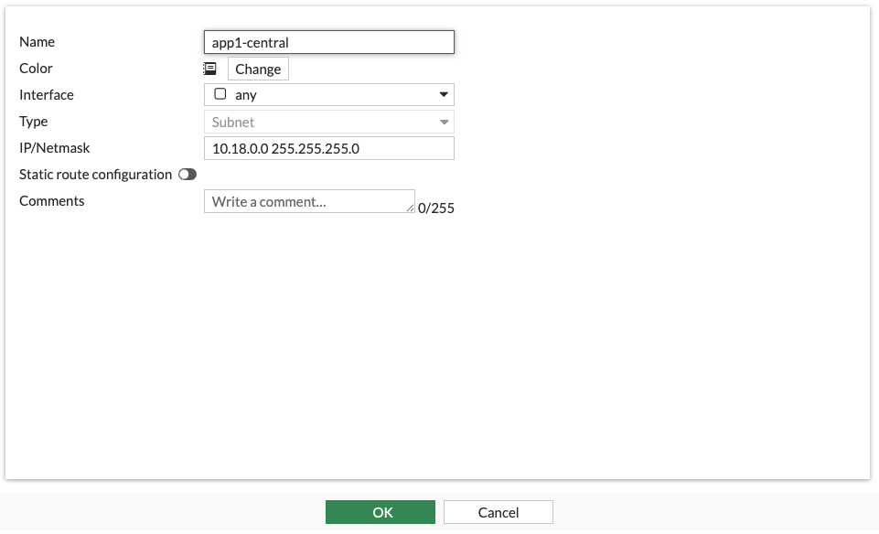
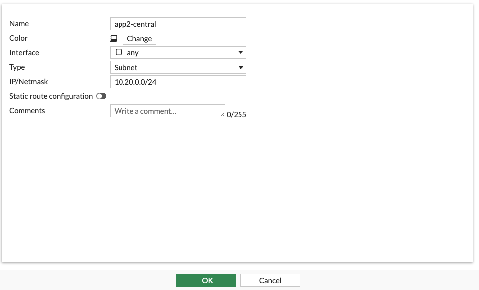
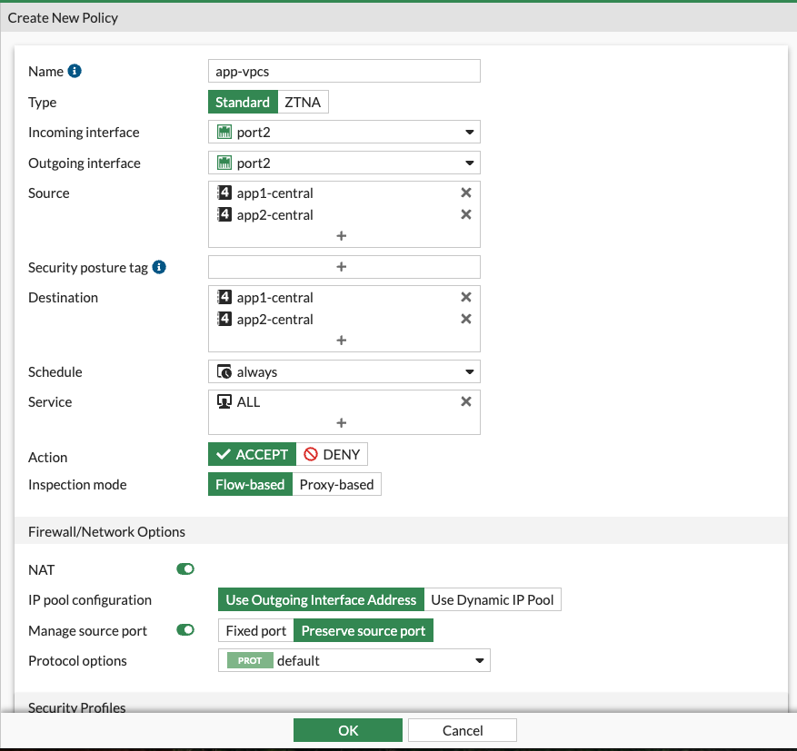
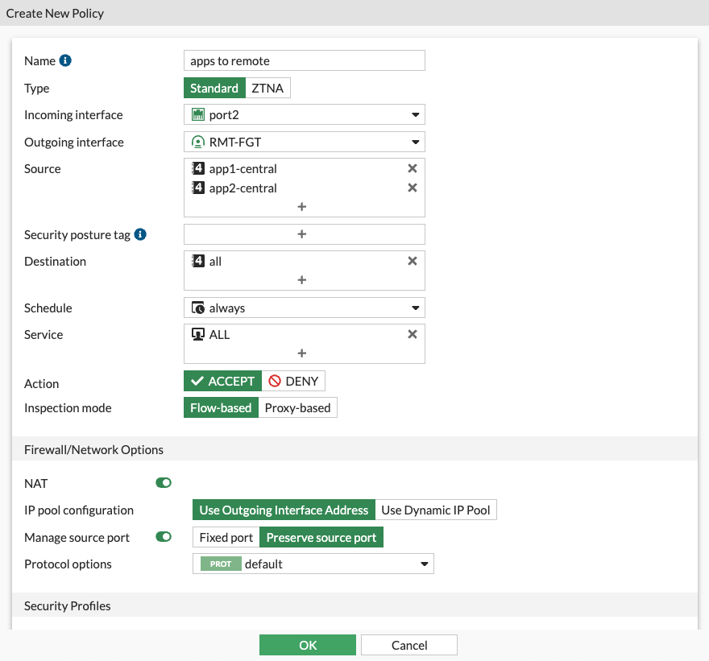
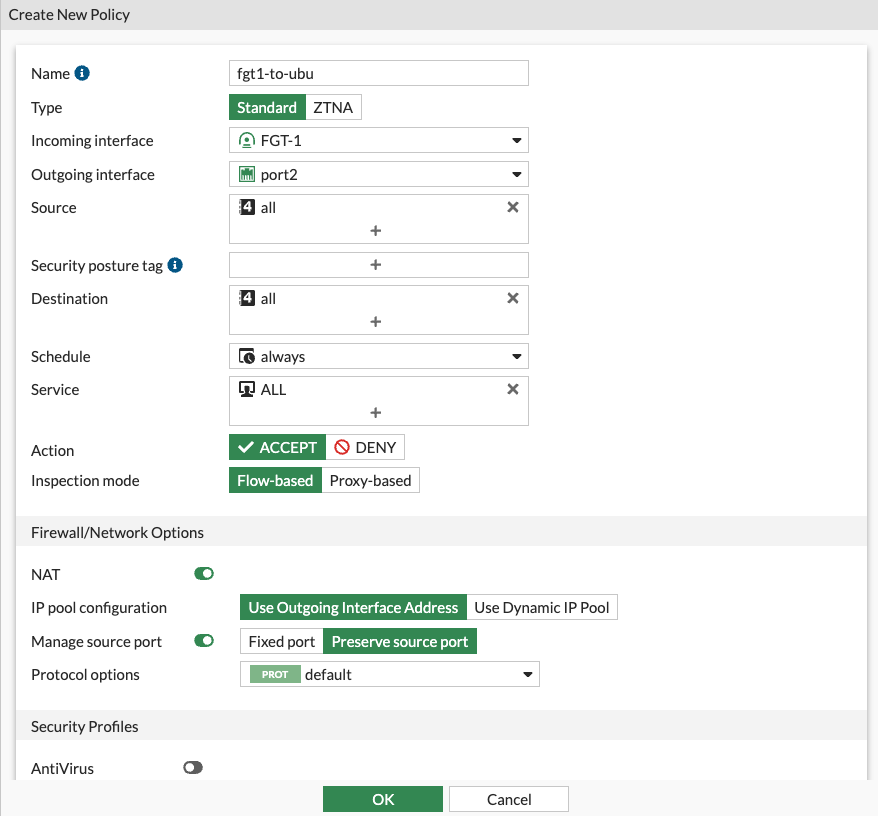

## Verify traffic

1. The Star topology in GCP NCC ensures that **edge** spokes can't talk to one another directly.  We set up the FortiGates as Center spokes, the application spokes must now traverse the Fortigate for inter-vpc communication or North/South connectivity to remote sites.

    - Navigate back to the application (peered) project
    - Using the Hambuger menu on the top left of the screen, navigate to Compute Engine > VM instances
    - Open the details for each VM and click on SSH to open SSH-in-browser sessions for both.
    - Start a ping from server 1 to server 2 ``` ping ping 10.20.0.2 ```  This should fail.

1. Create Address objects for the subnets containing the two servers.
    - Navigate to Fortigate GUI ``` https://<fortigate1 public ip>:8443 ``` in your browser
    - Navigate to Policy & Objects > Addresses
    - Click **Create** and add an address for each Central CIDR

    

    

1. Create a policy allowing the traffic

    - Navigate to Policy & Objects > Firewall Policy 
    - Click **Create new**
    - Configure the policy as below.  Anything not visible is left as default value

    

1. Verify that ping is working from 1 to server 2

1. Attempt connectivity to remote site from server 1

    - Start a ping from server 1 to server 2 ``` ping 192.168.100.2 ```  This should fail.

1. Create a policy allowing the traffic on FortiGate1

    - Navigate to Policy & Objects > Firewall Policy 
    - Click **Create new**
    - Configure the policy as below.  Anything not visible is left as default value

    

1. Create a policy allowing the traffic on Remote Fortigate

    - Navigate to Policy & Objects > Firewall Policy 
    - Click **Create new**
    - Configure the policy as below.  Anything not visible is left as default value

    

1. Verify connectivity to remote site from server 1

    - Start a ping from server 1 to server 2 ``` ping 192.168.100.2 ``` This should now succeed.
